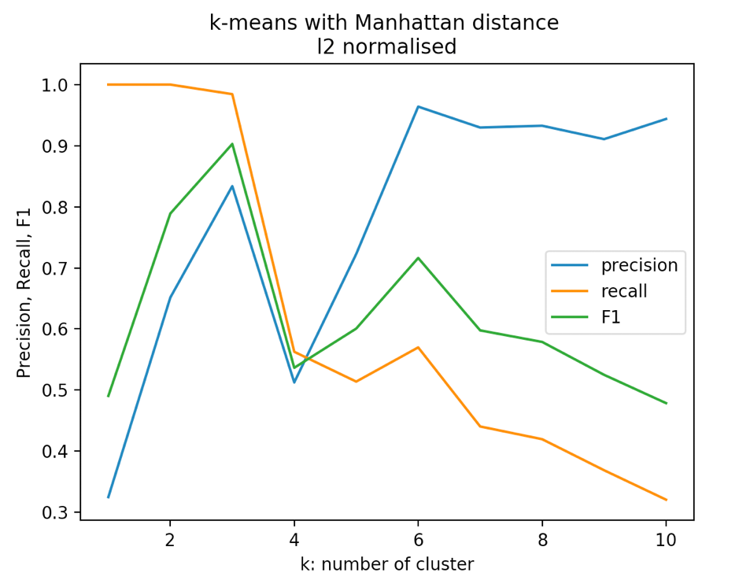

# k-means clustering algorithm with Euclidean distance and Manhattan distance

In this project, we are going to cluster words that belong to 4 categories: animals, countries, fruits and veggies. The words are organised into 4 different files in the data folder. Each word has 300 features (word embedding) describing the meaning. Besides, we vary the number of clusters k from 1 to 10 and compute the precision, recall, and F-score for each set fo clusters. By comparing the different clusterings through the result, it helps us to find the best k for this dataset.

k-means clustering algorithm:
Input: the number of clusters k, dataset Xn )
1. Select the number of k examples randomly from the dataset Xn as initial cluster centers
2. Compute the distance between each example and cluster centers by using Euclidean distance (or Manhattan distance)
3. Assign each example to the closest cluster center by choosing the minimum of Euclidean distance (or Manhattan distance)
4. Update the cluster centers by computing the mean of each cluster center
5. If no example is reassigned then break, otherwise repeat step 2-4

Based on the k-means clustering algorithm, we first define the algorithm in Python. Second, we have done some data preprocessing. For example, we load 4 dataset files and combine all the datasets into one dataset in order to implement the algorithm. Third, we compute the precision, recall and F-score according to k (1-10). Finally, we plot k in the horizontal axis and precision, recall and F-score in the vertical axis in the same plot, so we can draw a conclusion from all the plots.

Because the initial centers are randomly selected based on k, the final result could be different for each time we run the code. The final results are as below:

